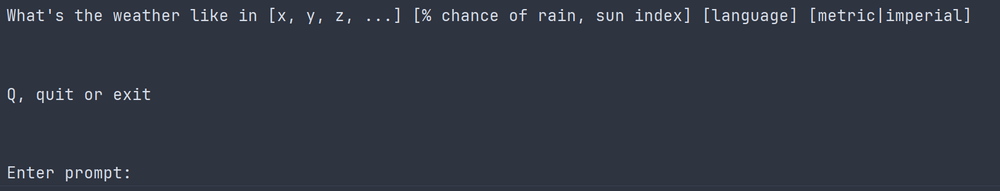
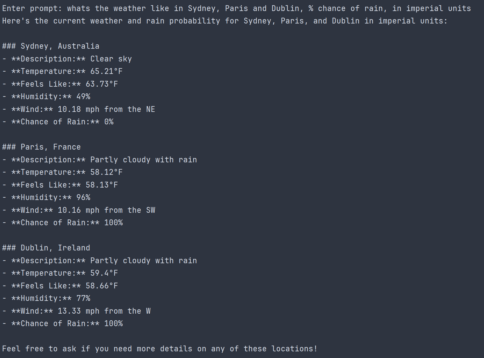
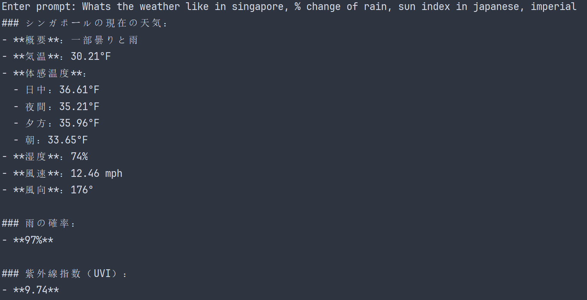
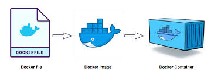

 

  


Weather app using OpenAI function calling
Python  
[Code sample ](https://cookbook.openai.com/examples/how_to_call_functions_with_chat_models) OpenAI function calling example


The example OpenAI code has been modified to:

1. modify the content for my use case
2. make a dockerhub repository `rbenson789/demo_openai_weather`

The repository on dockerhub can be pulled and run from a local machine.

```console
docker pull rbenson789/demo_openai_weather
docker run -i rbenson789/demo_openai_weather
```

# Demo Weather app using Docker and OpenAI

This is a Weather app using OpenAI function calling. Weather data is supplied by openWeather api calls.

The user is invited to enter a natural language prompt, free format, with suggested guidelines.

OpenAI will determine the model arguments for building JSON code for calls to a weather api and will call the relevant api's as appropriate for the prompt.

In the example code, 3 locations are used in the prompt, 3 api calls would therefore be expected to return data to the model.

Using the information in the user prompt, the model will determine a considered response using context and inferences. The number of api calls is decided by the model.

All response information is formatted by the model.

## Customisable Prompt
### Usage



## Prompt and Response


### request weather in 3 cities

The model has detected that there are 3 locations in the prompt and has extracted model arguments for api calls.

### longitude and latitude 
The api requests to openWeather require longitude and latitude to return json formatted weather results for that area. 

These have not been supplied by the user nor derived within the Python code. 

The model has been asked to supply these as required arguments to build JSON for api calls.



### Request response in Japanese 


## Docker Hub 

### pull from Docker Hub

`docker pull rbenson789/demo_openai_weather`

### run
#### interactive: -i

`docker run -i weather/demo_ai_app:1.0`


# Background

## Getting the app to Docker Hub.



## Dockerfile

```Dockerfile 
FROM python:3.12.1-slim

ARG A_weather_api_key
ARG A_openai_api_key

ENV WEATHERMAP_API_KEY3=$A_weather_api_key
ENV OPENAI_API_KEY=$A_openai_api_key


# Set the working directory in the container
WORKDIR /app

# Copy the requirements.txt file into the container at /app
COPY requirements.txt .

# Install the required dependencies
RUN pip install --no-cache-dir -r requirements.txt

# Copy the rest of the application code to the working directory
COPY . .

# Command to run the script
CMD ["python", "main.py"]
```

### passing hidden keys

do not expose api keys. 

#### standard build 

`docker build -t weather/demo_openai_weather:1.0 .`

#### set up api keys in the build

`docker build --build-arg A_weather_api_key=<your key> --build-arg A_openai_api_key=<your key> -t weather/demo_openai_weather:1.0 .`


## Run Image

`docker run -i  rbenson789/demo_openai_weather`

## input from keyboard:   -i


# Push to Docker Hub

`docker push rbenson789/demo_openai_weather`


## otherwise
`docker run weather/demo_ai_app:1.0`

## Images

`docker images`

## Remove Image

`docker rmi <docker_image_id> --force`

## Useful Docker Commands

|                            |                                |        Comment |
|----------------------------|:------------------------------:|---------------:|
| Build Image                | docker build -t <image_name> . |                |
| Run Image                  |   docker run -i <image_name>   | -i interactive |
| List Images                |       docker image list        |                |
| Remove Image               | docker image rm <image_id> -f  | -f means force |
| Remove all dangling images |       docker image prune       |                |


### remove container by status


`docker rm -v $(docker ps --filter status=exited -q)`


