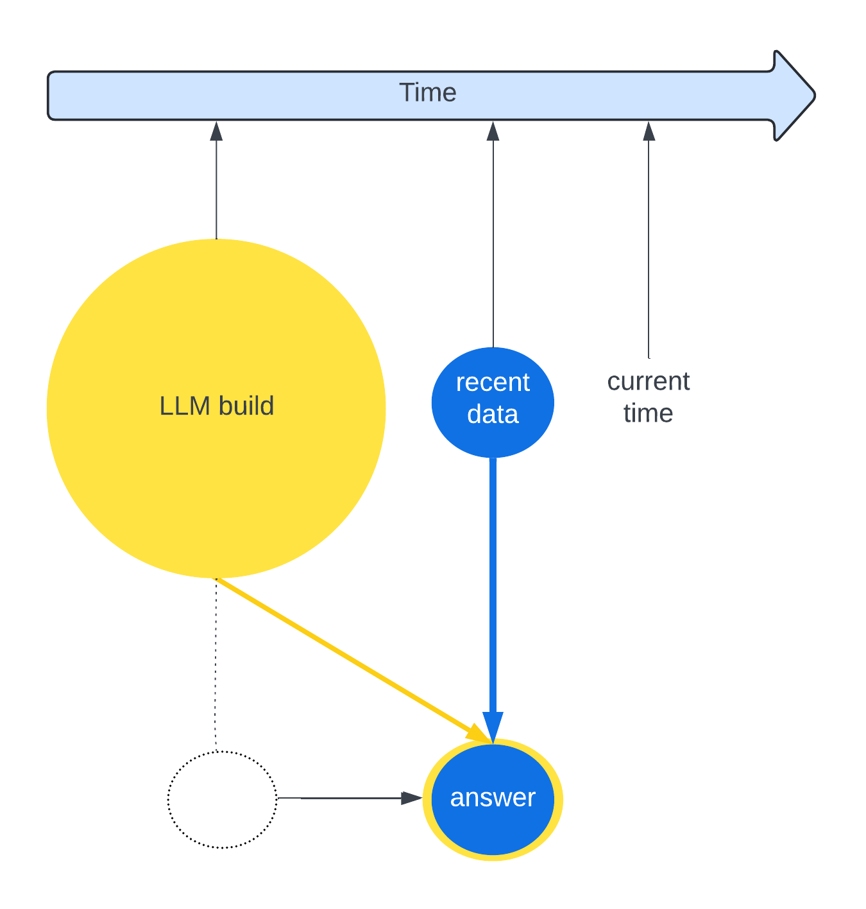
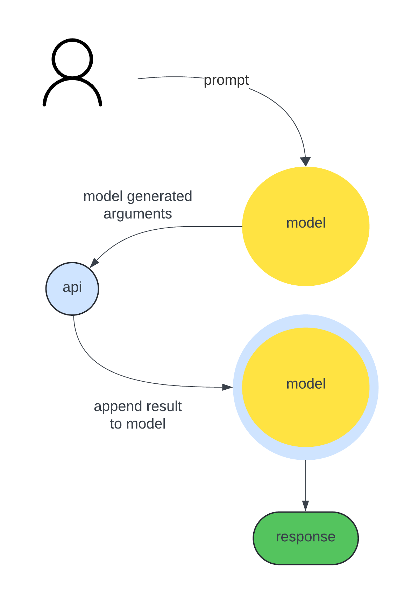

[//]: # ( )
  


# Demo Weather app using OpenAI - _Function Calling_
## Python code and Docker Image

This is a customizable Weather Python script using OpenAI [function calling](https://platform.openai.com/docs/guides/function-calling) and the OpenAI example [Code provided](https://cookbook.openai.com/examples/how_to_call_functions_with_chat_models).

This demo is available as a Docker image: 


| Docker | Command                                         |
|--------|-------------------------------------------------|
| Pull   | `docker pull rbenson789/demo_openai_weather`    |
| Run    | `docker run -i  rbenson789/demo_openai_weather` |


# Retrieval-Augmented Generation (RAG)

RAG allows real-time data and other data, that would not ordinarily be available to the LLM, to be incorporated into model generated responses.

There may be valid reasons to keep information out of the public domain and to only use it in controlled situations. 

Information may be new, and may have missed the last LLM build. For example, a car manufacturer has released a new car since the last build and wants to make that information available.


The retrieved information, using predefined api's, is used to "augment" the model data to give more detailed, grounded responses.


RAG allows the model to consider data that was not originally known to the LLM. 





The example OpenAI [Code](https://cookbook.openai.com/examples/how_to_call_functions_with_chat_models) has been modified to:

1. change the content for my use case, add actual real-time weather (openweather) and add prompt
2. make a Docker Hub repository `rbenson789/demo_openai_weather`

The repository on Docker Hub can be pulled and run on a local machine.

```console
docker pull rbenson789/demo_openai_weather
docker run -i rbenson789/demo_openai_weather
```

Weather data is supplied by openWeather api calls.

The user is invited to enter a natural language prompt, free format, with suggested guidelines.

OpenAI will determine the model arguments for building JSON for calls to a weather api. 
The setting up, and processing the return data will be handled by the model. 
The actual api call itself is a predefined api.
In this case, openweather api calls are used to augment model data. 

Any other weather agency could be used to fulfil the user requirements. 

In the example code, 3 locations are used in the prompt, detected by the model, 3 api calls return data to the model.

Using the information in the user prompt, the model will make a response using context and inferences.



[//]: # (![model_api_function_calling.png]&#40;model_api_function_calling.png&#41;)


## Customisable Prompt

### Guidelines for writing a good prompt

| #                    | Comment                                                                                                                                        | 
|----------------------|------------------------------------------------------------------------------------------------------------------------------------------------|
| Persona              | Give the model an idea of the  _type of person_ that you would like a response from.<br/>e.g.You are a weather bot, <br/>you are a maths expert etc |
| Be Clear and concise | no unnecessary commentary to distract                                                                                                          |
| Context              | e.g. _explain the theory of relativity_                                                                                                        |
| Scope                | define boundaries, in 200 words ..                                                                                                             |
| Specific             | avoid tell me, use What ...                                                                                                                    |
| Simple               | avoid jargon, technical phrases                                                                                                                |
| Examples             | en for English, nl (Dutch), fr (French)                                                                                                        |
| Break Down           | First, explain ... , then ....                                                                                                                 |
| Format               | e.g. Report in table format                                                                                                                    |
| Grammar and spelling | be accurate                                                                                                                                    |


### Usage for this script

```console
    What's the weather like in <location 1> <location 2> [<location>...] [% chance of rain] [language] [metric | imperial]
```


## Assistant

The assistant requires 3 inputs:
1. The model version, in this case gpt-4o
2. Functions to run
3. Instructions

### Instructions

This gives the model:
1. A persona to take, in this case, it is a weather bot. 
2. directions on how to run, i.e. use functions to answer questions.
3. The uv index on its own is not that meaningful. The model is told to refine that answer to add guidelines re sun exposure.
4. Add an emoji

```console
    You are a weather bot. 
    Use the provided functions to answer questions. 
    Add a detailed description of the precautions to take for that particular uvi. 
    All output should be in requested language. 
    Add an emoji for the weather eg sun for sunshine. 
    The output should be in a table format with metrics down and locations across
```


### Tools/Functions

**Function calling** uses defined functions that the model calls to retrieve relevant data. The functions and respective arguments are defined.
The model determines the function to call by the information available to it, using input, context and inference. 

If the prompt is asking for weather, it will call the _get_current_weather_ function.
If the prompt is looking for probability of rain, it will call the _get_rain_probability_ function.

### longitude and latitude ? 

The api requests to openWeather require longitude and latitude to return JSON formatted weather results for that area. 

These have not been supplied by the user nor derived within the Python code. 

The model has been asked to supply these as required arguments to build JSON for api calls. 
By using input locations, context and inference, the model can determine these.

## Prompt
Creating a good prompt is important. A good prompt can significantly enhance the quality of the model's output.

Be specific and avoid unnecessary information that may distract from the main task.

This example would expect to _see_ locations, language, percentage, units in the prompt. A vague and unspecific prompt may give vague results. 

```python
tools=[
            {
                "type": "function",
                "function": {
                    "name": "get_current_weather",
                    "description": "Get the current weather in a given latitude and longitude",
                    "parameters": {
                        "type": "object",
                        "properties": {
                            "latitude": {
                                "type": "string",
                                "description": "The latitude of a place",
                            },
                            "longitude": {
                                "type": "string",
                                "description": "The longitude of a place",
                            },
                            "language": {
                                "type": "string",
                                "description": "The language to respond with eg en for English, nl (Dutch), fr (French), sp (Spanish), ru (Russian), uk (Ukrainian)",
                            },
                            "unit": {"type": "string",
                                     "description": "measurements in either imperial or metric",
                                     "enum": ["imperial", "metric"]},

                        },
                        "required": ["latitude", "longitude"],
                    },
                },
            },
            {
                "type": "function",
                "function": {
                    "name": "get_rain_probability",
                    "description": "Get the probability of rain in a given latitude and longitude",
                    "parameters": {
                        "type": "object",
                        "properties": {
                            "latitude": {
                                "type": "string",
                                "description": "The latitude of a place",
                            },
                            "longitude": {
                                "type": "string",
                                "description": "The longitude of a place",
                            },
                        },
                        "required": ["latitude", "longitude"],
                    }
                }
            },

        ]
```

JSON response from the _get_current_weather_ function. 
The returned information from the api call will be augmented to the model. The model response will contain the following information. 

```console
result = {
        "description": weather_daily_summary,
        "temperature": weather_daily_temperature,
        "feels_like": weather_daily_temperature_feels_like,
        "humidity": weather_daily_humidity,
        "wind_speed": weather_daily_wind_speed,
        "wind_direction": weather_daily_wind_degree,
        "latitude": latitude,
        "longitude": longitude,
    }
```

### Example prompt
```console
    What's the weather like in Sydney, Paris and Dublin, % chance of rain, in imperial units 
```

## Prompt and Response


### request weather in 3 cities

Using the example prompt,the model has detected that there are 3 locations in the prompt and has extracted model arguments for api calls.


### Response


```console
| Metric         | Sydney 🌧️                  | Paris 🌧️                   | Dublin 🌧️                |
|----------------|----------------------------|----------------------------|--------------------------|
| **Temperature**| 59°F                        | 66.9°F                      | 57.7°F                   |
| **Description**| Partly cloudy in morning, rain in the afternoon  | Partly cloudy with rain   | Partly cloudy with rain  |
| **Wind Speed** | 15.3 mph                    | 9.9 mph                     | 15 mph                   |
| **Wind Direction** | 188°                   | 284°                        | 282°                     |
| **Humidity**   | 68%                         | 60%                         | 55%                      |
| **UVI**        | 2.85                        | 3.63                        | 4.41                     |
| **Rain Probability** | 100%                  | 27%                         | 20%                      |

### UV Index Precautions:
- **Sydney (UVI 2.85)**: Low risk. It's safe to be outside. Wear sunglasses on bright days.
- **Paris (UVI 3.63)**: Moderate risk. Use sunscreen SPF 30+, wear sunglasses and a hat if outside for extended periods.
- **Dublin (UVI 4.41)**: Moderate risk. Don a hat and sunglasses, and apply broad-spectrum SPF 30+ sunscreen if outside for prolonged periods.

Stay prepared and stay safe!
```
### Language
Prompt asking for output to be in Japanese 

```console
whats the weather like in singapore, % chance of ran , in Japanese and imperial units
```
#### response

```console
### 天気予報 🌤️

| メトリック       | シンガポール                  |
|-----------------|----------------------------|
| 天気概要         | 一時的に曇りと雨が予想されます。|
| 気温             | 28.24°F                    |
| 紫外線指数 (UVI) | 10                         |
| 湿度             | 78%                        |
| 風速             | 10.29 mph                  |
| 風向             | 135°                       |
| 降雨の確率       | 69%                        |

#### 紫外線対策について (UVI 10) ☀️

- **非常に強い紫外線に注意**: なるべく外出を控え、特に午前10時から午後4時の間は注意が必要です。
- **日焼け止めを使用**: 高いSPF値の日焼け止めをこまめに塗り直しましょう。
- **防護服**: 長袖シャツ、長ズボン、帽子、サングラスを着用しましょう。
- **屋内活動**: できるだけ屋内で活動し、直接の紫外線を避けましょう。

お出かけの際はこれらの対策を徹底してください。


```

```
In English, using Google Translate:

```console
### Weather forecast 🌤️

| Metric | Singapore |
|-----------------|----------------------------|
| Weather summary | Partly cloudy with rain expected. |
| Temperature | 28.24°F |
| Ultraviolet index (UVI) | 10 |
| Humidity | 78% |
| Wind speed | 10.29 mph |
| Wind direction | 135° |
| Chance of rain | 69% |

#### UV protection (UVI 10) ☀️

- **Beware of very strong UV rays**: Avoid going outside as much as possible, especially between 10am and 4pm.
- **Use sunscreen**: Apply a high SPF sunscreen and reapply frequently.
- **Protective clothing**: Wear long sleeve shirts, long pants, hats and sunglasses.
- **Indoor activities**: Avoid direct UV rays by staying indoors as much as possible.

Please be sure to follow these precautions when going out.
```


## Dockerfile

```Dockerfile 
FROM python:3.12.1-slim

ARG A_weather_api_key
ARG A_openai_api_key

ENV WEATHERMAP_API_KEY3=$A_weather_api_key
ENV OPENAI_API_KEY=$A_openai_api_key


# Set the working directory in the container
WORKDIR /app

# Copy the requirements.txt file into the container at /app
COPY requirements.txt .

# Install the required dependencies
RUN pip install --no-cache-dir -r requirements.txt

# Copy the rest of the application code to the working directory
COPY . .

# Command to run the script
CMD ["python", "main.py"]
```

### standard build 

`docker build -t weather/demo_openai_weather:1.0 .`

#### set up api keys in the build

`docker build --build-arg A_weather_api_key=<your key> --build-arg A_openai_api_key=<your key> -t weather/demo_openai_weather:1.0 .`

## Build image for Docker Hub
The name of the image on Docker Hub will be userid/repository name
`userid/repository name`

e.g. 
`docker build --build-arg A_weather_api_key=<key> --build-arg A_openai_api_key=<key> -t rbenson789/demo_openai_weather .`

## Run Image


`docker run -i  rbenson789/demo_openai_weather`


## login on local device

`Docker login`
enter user id and password


## Push Image to Docker Hub

`docker push rbenson789/demo_openai_weather`


## Pull Image from Docker Hub

`docker pull rbenson789/demo_openai_weather`

### run
#### interactive: -i

`docker run -i rbenson789/demo_openai_weather`


## Useful Docker Commands (local)


### remove container by status


`docker rm -v $(docker ps --filter status=exited -q)`

## Summary of Docker Hub commands

The image name will be a concatenation of the user id and repository name.

`userid/repository name`

```console
docker build --build-arg A_weather_api_key=<key> --build-arg A_openai_api_key=<key> -t rbenson789/demo_openai_weather .

docker login

docker push rbenson789/demo_openai_weather

docker run -i  rbenson789/demo_openai_weather

docker pull rbenson789/demo_openai_weather

```

 


